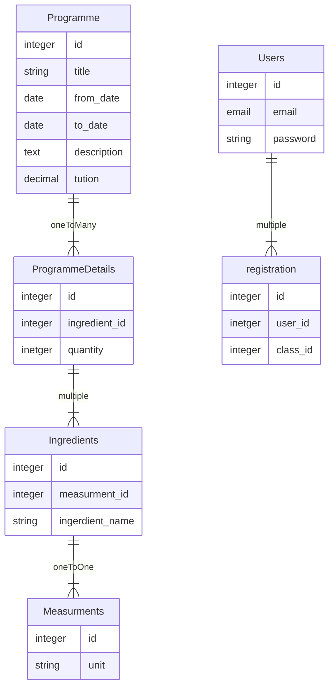

# kitchen-around-you

```mermaid
erDiagram
    Programme ||--|{ ProgrammeDetails : oneToMany
    ProgrammeDetails ||--|{ Ingredients : multiple
    Ingredients ||--|{ Measurments: oneToOne
    Users ||--|{ registration : multiple

    Programme {
        integer id
        string title
        date from_date
        date to_date
        text description
        decimal tution
    }

  ProgrammeDetails {
        integer id
        integer ingredient_id
        inetger quantity
    }

    Ingredients {
        integer id
        integer measurment_id
        string ingerdient_name
    }

    Measurments {
        integer id
        string unit

    }

    Users {
        integer id
        email email
        string password
    }

    registration {
        integer id
        inetger user_id
        integer class_id
    }
```
