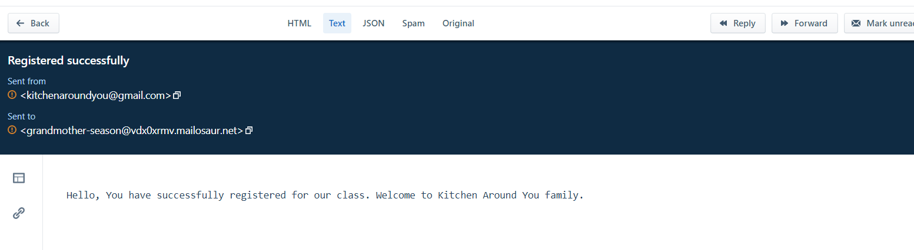

# kitchen-around-you

# Table of contents

- [What We Do](#what-we-dopose)
- [Concept](#concept)
- [Deployed Application](#deployed-application)
- [Technologies Used](#technologies-used)
- [Run Instructions](#run-instructions)
- [Future Enhancement](#future-enhancement)
- [Contributors](#contributors)

## What we Do

- Everyone enjoys good food; I think we can all agree on that. However, everyone's definition of what is good food is different.
- There are so many factors that influence our preferences that there is no universal food that everyone can enjoy.
- Rather then try, we have created a site that will cover whatever preference you have and even some preferences that your have yet to discover.
- Not just discover, but recreate and experiment, with Kitchen around you, you can try creating dishes from around that world.
- Just sign up, and start cooking!!!!

## Concept

We love cooking, its something that we all grew up admiring about our parents and grandparents. Learning to cook is not easy, some of us had to learn the hard way (trial and error). We wanted to find a way to make it more accessible to even the most tragic of soon-to-be chefs

## Deployed Application

Please find below URL for deployed application:
https://kitchen-around-you.herokuapp.com/

### User Story:

    As a food lover,
    I would like to enroll in a cooking class
    So that I can learn cooking

### Details:

    When I land on kitchen around you
    Then I will land on Home Page
    On Home page you will see Login/Sign up page and our Program offering.
    When you click one of Program offerings you will navigated to program details page
    In program details page you can see details of program and ability to register.
    When I am already logged in
    Then clicking on resiter will enroll in program and land on dashboard page and I will receive an email
    On Dashboard page, user will see all register classes
    When I click On logout
    Then I will land on Home page
    When I sign up
    Then my account is created and I will receive an email for sign up.

Deployed application images:

Home Page:

Program Offerings

Program Details

Dashboard

User will receive Email after registration

User will receive email after sign up

## Technologies Used

- bcrypt ver. 5.0.1
- Dotenv ver. 16.0.0
- Express ver. 4.17.3",
- express-session ver. 1.17.2
- Handlebars ver. 4.7.7
- Mysql2 ver. 2.3.3
- Sequelize ver. 6.17.0
- NodeMailer ver 6.7.2
- Deployed to Heroku
- Front Framework - Bulma

Please refer below diagram for database structure

Please check insomnia collection [here](./assets/Insomnia_collection)

## Contributors

- Krupali
- Fabian
- Alex

## Future Enhancement

- Avoid duplicate registrations
- Ability for user to cancel program enrollment
- Add html to email to add more details and to enhance look and feel
- Admin user who can see number of registrations per program
- Feedback for program
